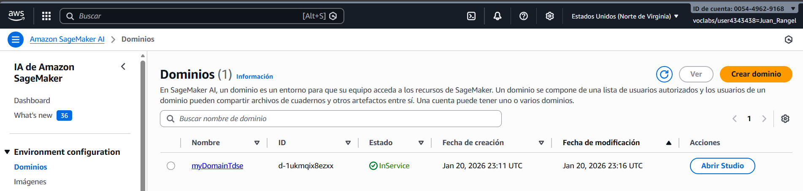
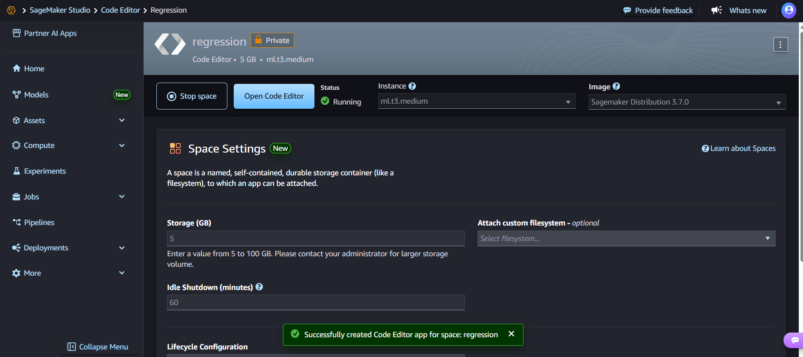
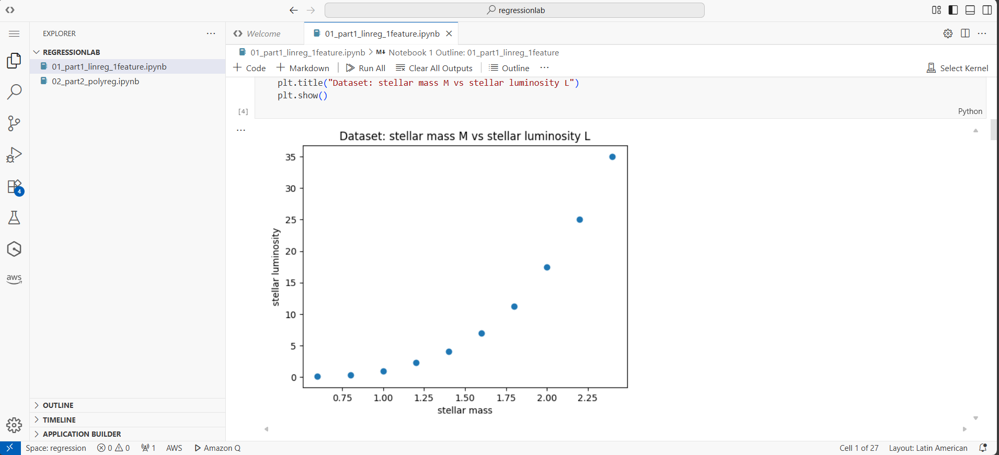
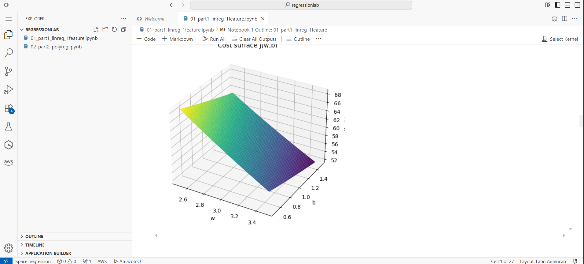
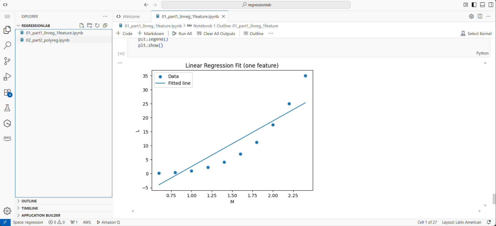
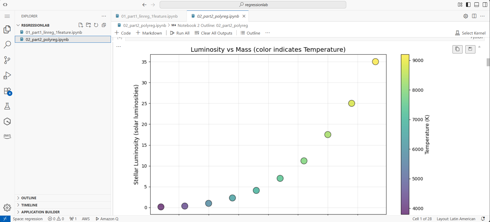
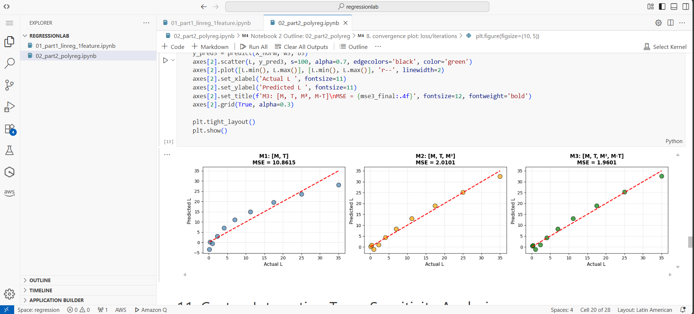

# Linear and Polynomial Models for Regression

This project develops linear and polynomial regression models from the ground up to represent the relationship between stellar mass and luminosity. The work is organized into two stages: the first focuses on simple linear regression using a single input (stellar mass), while the second expands to polynomial regression with multiple inputs (mass and temperature). Gradient descent is implemented in both vectorized and non-vectorized forms, 
the cost landscape is visualized, and the performance of different models and learning rates is analyzed and compared.

## Getting Started

These instructions will get you a copy of the project up and running on your local machine for development and testing purposes.
See deployment for notes on how to deploy the project on a live system.

### Prerequisites

Prerequisites

Python 3.3 or higher

Jupyter Notebook or JupyterLab

Python libraries:

numpy

matplotlib

mpl_toolkits (included with matplotlib)

### Installing

Steps to set up the development environment:

1. Clone or download the project repository

2. Install the necessary dependencies:

3. Open the notebooks in Jupyter:
4. Run the notebooks in order:
01_part1_linreg_1feature.ipynb: Simple linear regression
02_part2_polyreg.ipynb: Polynomial regression with multiple features

## Running the notebooks

After installation, execute the notebooks in order:

**Notebook 1: Linear Regression (Single Feature)**
```bash
jupyter notebook 01_part1_linreg_1feature.ipynb
```

Run all cells sequentially to:
Visualize the M vs L relationship

Compute cost surface and gradients

Train the model using gradient descent

Analyze convergence behavior

Evaluate model performance

**Notebook 2: Polynomial Regression (Multiple Features)**
```bash
jupyter notebook 02_part2_polyreg.ipynb
```

Run all cells to:
Compare 3 different feature combinations

Analyze interaction term importance

Perform inference on new data

Visualize predicted vs actual results

---
## AWS SageMaker Execution Evidence

### Deployment Process

The notebooks were successfully deployed and executed on **AWS SageMaker Studio** following these steps:

1. Access SageMaker Studio via AWS Console
2. Create Notebook Instance with ml.t3.medium configuration
3. Upload Notebooks (`01_part1_linreg_1feature.ipynb` and `02_part2_polyreg.ipynb`)
4. Execute All Cells in sequential order
5. Verify Outputs including plots and numerical results

Below are screenshots demonstrating successful cloud execution:

**Both Notebooks Open in SageMaker Studio**




**Notebook 1 - Successful Execution**




---

**run all**




**Notebook 2 - Feature Comparison Results**

**run all**



### Local vs SageMaker Execution Comparison

| Aspect | Local Execution | AWS SageMaker Execution |
|--------|----------------|-------------------------|
| **Setup Time** | ~5 minutes (env setup) | ~2 minutes (instance ready) |
| **Numerical Results** | Identical MSE values | Identical MSE values |
| **Execution Speed** | Comparable | Comparable (ml.t3.medium) |
| **Plot Rendering** | Inline in Jupyter | Inline in SageMaker Studio |
| **Reproducibility** | Depends on local Python version | Guaranteed (containerized env) |
| **Scalability** | Limited by local hardware | Can scale to GPU instances |
| **Collaboration** | Manual file sharing | Built-in sharing features |
| **Cost** | $0 (local resources) | ~$0.05/hour (ml.t3.medium) |

# Datasets


### Part 1

```
M = [0.6, 0.8, 1.0, 1.2, 1.4, 1.6, 1.8, 2.0, 2.2, 2.4]
L = [0.15, 0.35, 1.00, 2.30, 4.10, 7.00, 11.2, 17.5, 25.0, 35.0]
```

Where
 - **M**: Stellar mass
 - **L**: Luminosity  

### Part 2

```
M = [0.6, 0.8, 1.0, 1.2, 1.4, 1.6, 1.8, 2.0, 2.2, 2.4]
T = [3800, 4400, 5800, 6400, 6900, 7400, 7900, 8300, 8800, 9200]
L = [0.15, 0.35, 1.00, 2.30, 4.10, 7.00, 11.2, 17.5, 25.0, 35.0]
```

Where
 - **M**: Stellar mass
 - **L**: Luminosity
 - **T**: Temperature 

 ## Built With

* **[NumPy](https://numpy.org/)** - Numerical computing and vectorized operations
* **[Matplotlib](https://matplotlib.org/)** - Data visualization and plotting
* **[Pandas](https://pandas.pydata.org/)** - Data structure and analysis (optional)
* **[Jupyter](https://jupyter.org/)** - Interactive notebook environment
* **[AWS SageMaker](https://aws.amazon.com/sagemaker/)** - Cloud-based ML platform for deployment

---

## Authors

* **Juan Felipe Rangel Rodriguez** - *TDSE lab 1*
  - Escuela Colombiana de Ingeniería Julio Garavito

---
## Acknowledgments

* Example data based on the stellar mass-luminosity relationship from astrophysics
* Machine learning concepts and linear regression

* Educational implementation of gradient descent from scratch
